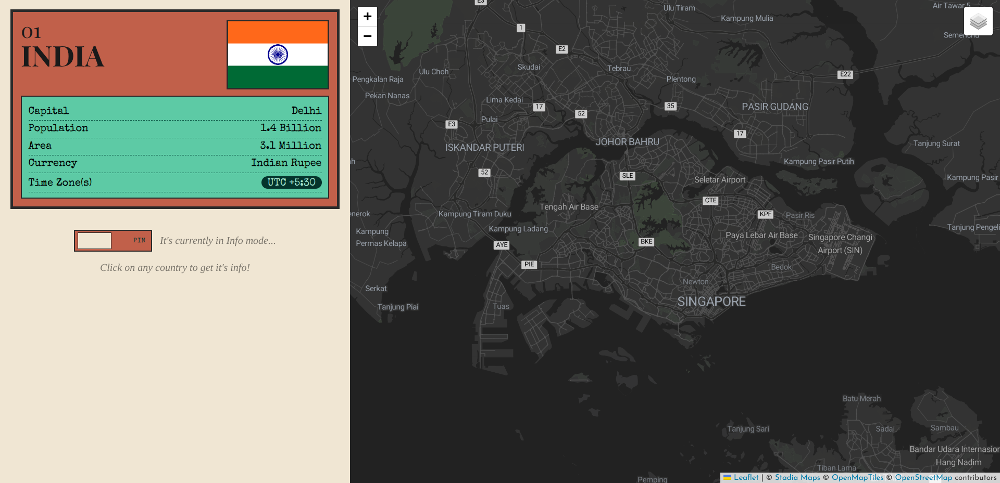
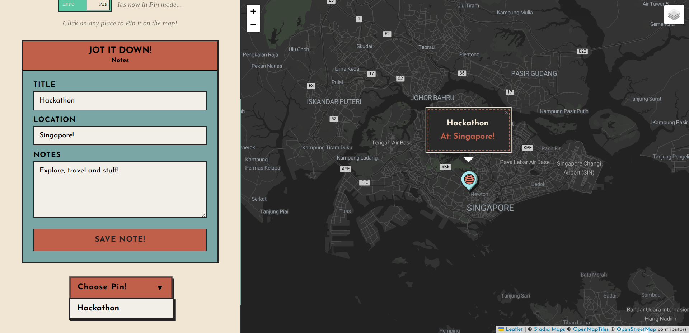

# The-Map

**The-Map is a map based website, for countries' info and Pinning your future travel places!**  
- **Info Mode:** You click any *country* on the map, and get info like **name, capital, time zones,** etc!
- **Pin Mode:** You click a location on the map, and pin it! It can be your **vacation plans, or trips, anything!**

I have used **Leaflet and OpenStreetMaps** for the Map, **REST Countries API** for Country Info and **Nominatim** for fetching country from **coordinates.**

**Current Status:** v2 is completed, and the website is fully functional.  

### Data
It's obvious, but for clarity, I don't have access to any of your **saved or pinned locations and notes**. There is no backend(as of v2), and all the data stored is in your **browser's local storage.**  

### For devs
I also have very descriptive commits and have a rough-journal of how I made this, so you can refer to it if you want to understand the website :)