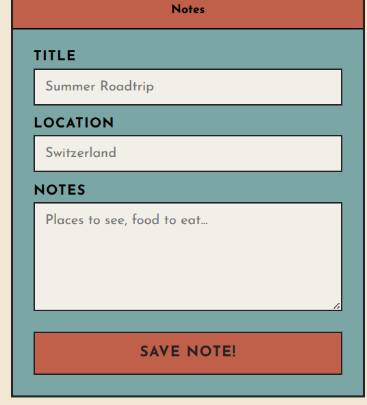

## Random Stuff I am journaling or documenting for future references

Okay, so like you know maybe a bit of JS now. SO you read the leaflet docs and some tutorials on the site to set up a basic map and pointers, etc

First we will do this, and then we will move on to the main rendering lat and lng.


to **add the Map**, we first initialise the map and set it's view to the co-ordinates we want:

`let theMap = L.map('map').setview([51.505, -0.09], 13);])`


to add a **marker**:


`L.marker([x, y]).addTo(map)`

to make the marker **say** something :

`marker.bindPopup("meow").openPopup()` 


### Eg of this:

`let theMarker = L.marker([x, y])` --> this is declaring the marker co-ordinates.  

`let thePopup = theMarker.bindPopup("meow")` --> this is pushing the value of popup into the marker


`thePopup.addTo(map)` --> this adds it to the map

---
### Layers
hmm, so I added currently 3 map layers, which seems fine as of now

### The Coordinate thing and API calling

So hell yeah! I managed to get th e latitude and longitude and store it in the local variables inside the function, and now the main part is fetching the json file containing the details  

So from nominatim, we receive address with country code which is in alpha 2 code. ANd this is exactly what we will use to get name and currency and all of the country

now as we have the country code, we will going towards getting country details from **REST countries api**

### Country info fetching

```javascript 
/countries/v5/codes.alpha_2/${countryCode}?pretty=1
```
^^ THis is what we are gonna use. The country code we are receiving from *Nominatim*, we pass through this!  

The result we get is something like:  
[Example of response we receive from REST](/example/country-info.json)

So few things which is of our use:  
1. **The Country Name:** *data.objects[0].names.common*
2. **Capital:** *data.objects[0].capitals[x]*
3. **Flag URL:** *data.objects[0].flag.url_png*
4. **Area:** *data.objects[0].area.kilometers*
5. **Currencies:** *data.objects[0].currencies[0].name*
6. **Time Zones:** data.ojects[0].timezones[x]
7. **Population:** data.objects[0].population
   
holy shit man I hate css. it's just..

**Okay, Everything's done after a lot of time and fixing things**  

Let's have a recap or tldr of things done  
**What's done till yet:**  
1. **Leaflet map** rendering on the page with help of **OSM**
2. Added different *Layers* to the page like dark, etc.
3. Next up learned about the leaflet stuff like methods and click functions and all!
4. With this, I then extracted the **coordinates** of any place user *clicks*
5. Then I used **Nominatim** to get the address of that particular location user clicks; but my main usecase is extracting the *2 digit alpha code* of the country the user clicks
6. So with this *code*, I can use the REST countries API to get country info!! (I listed above what im gonna display from this info)
7. Now to display this stuff, HTML & CSS was to be at work. I designed a what you can say is a card type post-stamp (idk what else to call it) and oh man, CSS is really a mess if you don't know stuff, like really. 
8. Jokes apart I managed to make a simple placeholder of this stamp which displays info, and now I just need to plug in the details I received from REST.
   
### Displaying the info

Now as we have the name, flag, currency, population, area and Capitals' & Timezones' array, we jut need to display it!

**Name, flag & currency** is just straight up easy and done! I thought **capital** would also be easy but realised some countries have more than one *capital*, so I stored them into an *array*
Then I made a func to loop through it and display is as a *list* on the page!

Next I will be doing is making a module(coz why not) that converts big numbers like **1,000,000,000** to **1 Billion** which is more readable and better  
yupp so made it, and now numbers are human readable!  

So recap of what's done: Name, Capitals, Area, Population, flag and currency!!  
Now the Time Zones!  

So the thing is the capitals and timezones are somewhat similar, like in the context of storing and displaying stuff; So I am combining them into same **Function: addingList()**

## V1 Completed!
Yessssssssssss! It's finally doneee.User clicks a country and voila!!!! 

---
### Things to do now

1. Hmm, so some bugs like **clicking water** and **outside the scope** gets some error needs to be fixed.  
2. And crazy **optimization** is needed a lot, like really. Istg I won't understand the code myself after few days coz of how messy it is. 
3. **Pinning the location** stuff after this.

## Pinning and saving things
So almost everything's done. Made the code a lot more cleaner!  
Now let's do the Pin stuff!

I didn't journal for quite long, so let me write in brief what i did:  

So after the v1 was complete, i made the js code readable by dividing each function.  
Then I went for doing my next part of this project which is a notes section where you can write down your thoughts and notes a particular location like for eg: Holidays in Italy and write the to-do things you wanna experience, etc.  
  
So I designed the rough layout on pen-paper, then CSS, but I stumbled into a dead-end, so Gemini helped me a lot, the **flex stuff**, and the **animations** **and shadows** and all.  
And the honourable mention: *Claude* made the **toggle switch**! yup, I couldn't think of much, so he made it, and I did sm chages and **voila!**

WIth this, now the user can save their notes, and it will appear on the map!
It's currently stored temporarily like in the browser, and are gone once the user refreshes.  

Now the Saved Notes part:  
I will be making a drop down so the user sees what they have saved!  
But there's an **issue**. I thought of using the select tag of html, but while using it, I got to know that you can't really style it properly. So I'll be making it custom, like with javascript and buttons!